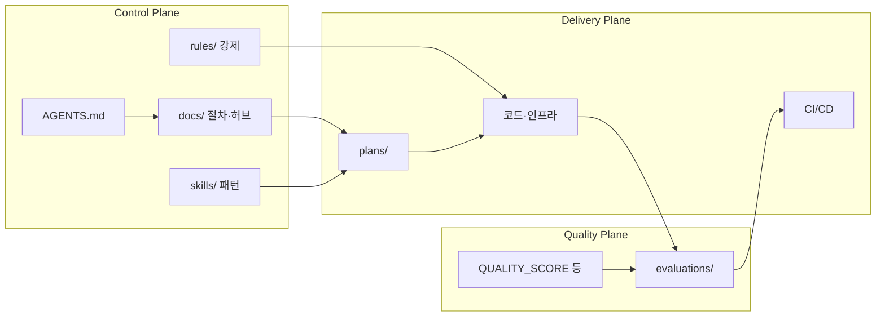

# Harness Engineering System — 전체 아키텍처 설계서

이 문서는 `AGENTS.md`에 정의된 AI Harness System을 **구현 가능한 아키텍처**로 서술한다. 외부 위키에 의존하지 않으며, 모든 에이전트는 `AGENTS.md` → 본 문서 → `docs/INDEX.md` 순으로 로드한다.

## 0. `AGENTS.md` 요구사항 매핑

| `AGENTS.md` 절 | 본 설계에서의 담당 |
|----------------|-------------------|
| [1] 시스템 목표 | 루트 정책 문서 + `plans/`로 AI 생성물 범위 명시 |
| [2] 핵심 철학 | 전역 불변조건(인간=방향, 실패=시스템 개선) |
| [3] 구조 | 본 문서 §1·§2, `docs/FOLDER_PURPOSE.md` |
| [4] 실행 루프 | `docs/WORKFLOW.md`(단일 SoT) |
| [5] 피드백 | `docs/FEEDBACK.md`, `references/TOOLS.md` |
| [6] Agent Legibility | `docs/INDEX.md`, `docs/FOLDER_PURPOSE.md`, `references/NAVIGATION.md` |
| [7] 아키텍처 제약 | `architecture/*`, `rules/*`, 향후 린터/테스트 |
| [8] 자기 개선 | `docs/SELF_IMPROVEMENT.md`, `skills/incident-to-rule` 등 |
| [9] 컨텍스트 | `docs/CONTEXT.md`, `plans/` 단위 분할 |
| [10] 출력 형식 | 루트+`docs/`+`evaluations/`에 분산 구현 |
| [11] 최종 요구 | §5 확장·회복력·자율 실행 |

## 1. 논리 아키텍처 (Control / Quality / Delivery)

시스템을 세 개의 평면으로 본다. **의존성은 Delivery가 Quality와 Control의 정책을 위반하지 않게** 맞춘다.

- **Control Plane**: “무엇을 어떻게 하면 안 되는가”와 “어떤 순서로 일하는가”.
- **Quality Plane**: “증거가 있는가”, “측정 가능한가”.
- **Delivery Plane**: “계획 대비 무엇이 바뀌었는가”, “배포 가능한가”.

## 2. 물리 구조와 책임 경계

| 물리 경로 | 책임 | 비책임(의도적 제외) |
|-----------|------|---------------------|
| `docs/` | 워크플로·피드백·컨텍스트·예시 | 도메인 비즈니스 규칙의 장기 저장(→ `architecture/`·ADR) |
| `plans/` | 작업 단위 목표·검증·롤백 | 제품 전체 비전(→ `PRODUCT_SENSE.md`) |
| `architecture/` | 레이어·의존성·ADR | 일일 티켓 수준 잡무 |
| `skills/` | 반복 절차 | 정책 수준 강제(→ `rules/`+CI) |
| `rules/` | 강제 규칙 문언 | 자동 실행 로직 본문(→ 스크립트·린터 설정) |
| `evaluations/` | 루브릭·시나리오·체크리스트 | 런타임 모니터링 대시보드 자체(→ `references/TOOLS.md`에 접근 경로만) |
| `scripts/` | 검증 자동화 최소 구현 | 대규모 테스트 러너(→ 제품 레포 언어별 도구) |

### 2.1 하네스 확장: 리뷰·테스트·로그·자동 개선

| 하위 시스템 | 문서 | 요약 |
|-------------|------|------|
| 멀티 에이전트 리뷰 | `docs/MULTI_AGENT_REVIEW.md` | QA/보안 역할 분리, 순서, 합의 기록 |
| 자동 테스트 생성 | `docs/AUTO_TEST_GENERATION.md` | 구현 직후 테스트 초안·경계 포함 원칙 |
| 로그 기반 피드백 | `docs/LOG_FEEDBACK.md` | 로그 계약, 스냅샷, 트리아지 루프 |
| 실패 시 자동 개선 | `docs/AUTO_IMPROVEMENT_ON_FAILURE.md` | CI/로그 트리거, 패치 PR 초안, 가드레일 |

## 3. 애플리케이션 코드 레이어 (`AGENTS.md` [7])

제품 코드가 본 저장소 또는 패키지에 추가되면 **단방향 레이어만** 허용한다.

`Types` → `Config` → `Repo` → `Service` → `Runtime` → `UI`

- 상세: `architecture/LAYERED_MODEL.md`, `architecture/DEPENDENCY_RULES.md`, `architecture/CODE_LAYOUT.md`
- 강제: `rules/layering.md` + (도입 시) 린터·`evaluations/scripts/` 경계 검사

## 4. 자동화 아키텍처 (`AGENTS.md` [3] 자동화)

| 계층 | 구성 요소 | 역할 |
|------|-----------|------|
| CI/CD | `.github/workflows/harness-ci.yml` | PR마다 구조·게이트 실행 |
| 구조 검증 | `scripts/harness-validate.sh` | 필수 문서·디렉터리·스킬 수 하한 |
| 린터 | (향후) 언어별 설정 | 스타일·일부 보안 안티패턴 |
| 문서 검증 | (향후) 링크 체크·용어 검사 | 깨진 그래프 방지 |

현 단계에서 **반드시 동작**하는 것은 CI + `harness-validate.sh`다. 린터·문서 검증은 제품 스택 도입 시 같은 원칙으로 추가한다.

## 5. 확장·회복력·장시간 실행 (`AGENTS.md` [11])

- **수백만 라인**: 패키지/서비스 경계마다 `plans/`와 평가 스위트를 샤딩; 공유 `Types`만 얇게 유지.
- **소규모 팀**: 리뷰 부담을 루브릭·체크리스트·CI 하드 게이트로 이동.
- **6시간+ 자율**: `docs/WORKFLOW.md`의 체크포인트·`RELIABILITY.md`의 멱등·재시도; 중간 산출물은 PR 초안 또는 아티팩트.
- **실패에 강함**: 피드백 층위별 에스컬레이션(`docs/FEEDBACK.md`) + 인시던트→규칙(`docs/SELF_IMPROVEMENT.md`) + **실패 시 자동 개선 루프**(`docs/AUTO_IMPROVEMENT_ON_FAILURE.md`).

## 6. 데이터·신뢰 경로

- **SoT(Source of Truth)**: 마크다운과 버전 관리된 설정·코드. 슬랙/노션은 통지용이며 진실이 되지 않는다 (`AGENTS.md` [6]).
- **증거 체인**: `plans/`(의도) → 커밋(diff) → 테스트 로그/아티팩트 → PR 본문.

## 7. 관련 문서

- 폴더별 존재 이유: `docs/FOLDER_PURPOSE.md`
- 10단계 실행 루프: `docs/WORKFLOW.md`
- 에이전트 첫 화면: `docs/INDEX.md`
- 멀티 리뷰·자동 테스트·로그·자동 개선: `docs/MULTI_AGENT_REVIEW.md`, `docs/AUTO_TEST_GENERATION.md`, `docs/LOG_FEEDBACK.md`, `docs/AUTO_IMPROVEMENT_ON_FAILURE.md`

## 8. 변경 관리

본 설계를 바꾸면 `plans/`에 이유·영향·롤밄을 남기고, `evaluations/` 루브릭과 CI 목록(`harness-validate.sh`)의 정합을 검증한다.
