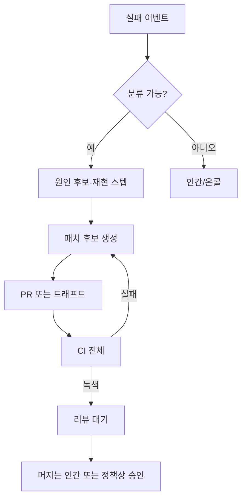

# 실패 시 자동 개선 구조

`AGENTS.md` [2][8]에 따라 실패는 **프롬프트 일회 수정**이 아니라 **시스템 변경(코드·규칙·테스트·문서)**으로 흡수한다. 본 문서는 **자동화 가능한 구간**을 정의한다.

## 1. 트리거(시작 조건)

| 트리거 | 예시 | 자동화 허용 범위 |
|--------|------|------------------|
| CI 실패 | 린트·테스트·구조 검증 | 패치 PR 초안 |
| 로그 이상 | 에러율 급증, 반복 스택 | 트리아지 + 완화 PR 초안 |
| 루브릭 하드 근접 | 보안 차단 직전 | 차단 PR(되돌림) 제안 |

**자동 머지**는 기본 **금지**. 예외는 별도 ADR + 브랜치 보호 예외 정책.

## 2. 자동 개선 파이프라인

## 3. 에이전트 역할

| 단계 | 주체 | 산출물 |
|------|------|--------|
| 분류 | 트리아지 에이전트 | 로그 발췌 + 가설 + 재현 명령 |
| 패치 | 구현 에이전트 | 커밋·테스트(자동 생성 포함) |
| 검증 | CI | 동일 파이프라인 |
| 승격 | `skills/incident-to-rule` | `rules/`·`evaluations/`·ADR |

## 4. 안전 가드레일

- **비밀·광범위 리팩터 금지 자동**: 토큰 회전·인프라 권한 변경은 사람 승인.
- **변경 상한**: 한 PR의 라인/파일 상한을 `plans/`에 명시.
- **롤밄**: 플래그·revert 절차를 PR 본문에 필수.

## 5. `SELF_IMPROVEMENT`와의 관계

- 본 문서: **자동 시도·PR 초안·CI 루프**
- `docs/SELF_IMPROVEMENT.md`: **지식·규칙으로의 영구 흡수**

## 6. 관련 스킬

- `skills/failure-remediation-loop/SKILL.md`
- `skills/incident-to-rule/SKILL.md`
- `skills/auto-test-generation/SKILL.md`(회귀 방지)
