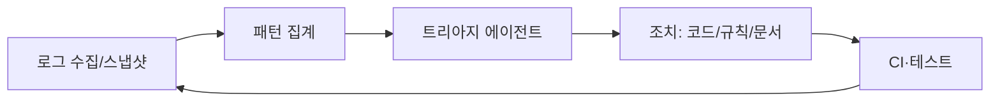

# 로그 기반 피드백 시스템

`AGENTS.md` [5]와 `docs/FEEDBACK.md` 층 4를 **구조화된 로그**에 특화해 구현한다. 에이전트가 CI·런타임 로그를 **읽고 분류·조치 제안**까지 할 수 있게 한다.

## 1. 목표

- 로그에서 **증상 → 원인 가설 → 검증 가능한 다음 행동**으로 연결한다.
- 사람만 읽는 대시보드에 의존하지 않는다(`PRODUCT_SENSE.md`).

## 2. 로그 계약(권장 필드)

구조화 로그(JSON 한 줄 권장)는 최소 다음 키를 갖는다(`rules/logging.md` 정합).

| 필드 | 용도 |
|------|------|
| `timestamp` | 정렬·윈도우 |
| `level` | 필터링 |
| `service` | 소스 식별 |
| `correlation_id` | 트레이스 연결 |
| `event` | 도메인 이벤트명 |
| `error.type` / `error.code` | 집계 |

## 3. 에이전트가 읽는 경로

| 소스 | 에이전트 접근 |
|------|----------------|
| CI 로그 | GitHub Actions / 아티팩트 URL |
| 스테이징·프로덕션 | 읽기 전용 export, MCP, 또는 주기적 스냅샷 |
| 로컬 재현 | 동일 명령 + 동일 `LOG_LEVEL` |

**민감정보**: 마스킹 후 `evaluations/feedback-logs/`에 샘플을 둘 수 있다(본문 금지 데이터는 `SECURITY.md`).

## 4. 피드백 루프

- 트리아지 결과는 PR 또는 `plans/`에 **한 단락 요약**으로 남긴다.
- 반복 패턴은 `docs/AUTO_IMPROVEMENT_ON_FAILURE.md`로 넘긴다.

## 5. 저장소 내 샘플 위치

- `evaluations/feedback-logs/README.md` — 샘플·스냅샷 배치 규칙

## 6. 관련 문서

- `docs/FEEDBACK.md`
- `references/TOOLS.md`
- `evaluations/scenarios/LOG_BASED_TRIAGE.md`
