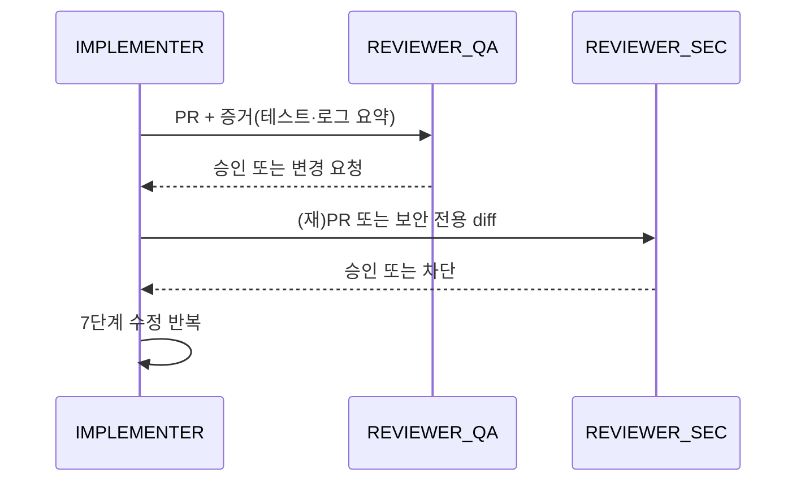

# 멀티 에이전트 리뷰 구조

`AGENTS.md` [4] 6단계(다른 에이전트 리뷰)를 **역할·산출물·게이트**로 고정한다. 단일 에이전트의 자기 리뷰(5단계)와 분리한다.

## 1. 역할(Roles)

| 역할 | 코드명 | 책임 | 금지 |
|------|--------|------|------|
| 구현 | `IMPLEMENTER` | 코드·테스트·PR 본문 초안 | 리뷰 코멘트를 “무시”하고 머지 요청 |
| 리뷰(품질) | `REVIEWER_QA` | 루브릭·회귀·경계 조건 | 제품 요구사항 임의 변경 |
| 리뷰(보안) | `REVIEWER_SEC` | 비밀·주입·권한·로그 누설 | 기능 승인 단독(품질과 병행) |
| 조정 | `ORCHESTRATOR` | 순서·타임박스·에스컬레이션(선택, 사람 또는 에이전트) | 구현 대행 |

소규모 팀에서는 `REVIEWER_QA`와 `REVIEWER_SEC`를 **동일 에이전트 세션에 순차 적용**할 수 있으나, 산출물은 구분해 남긴다.

## 2. 실행 순서(권장)

- **병렬 금지 조건**: 보안 리뷰가 “차단”이면 QA 승인만으로 머지하지 않는다.
- **타임박스**: 리뷰 에이전트는 `plans/`에 적힌 SLA 내에서 완료하거나, 명시적으로 `blocked`로 되돌린다.

## 3. 산출물 표준

| 산출물 | 위치 | 필수 내용 |
|--------|------|-----------|
| QA 리뷰 | PR 코멘트 또는 `evaluations/checklists/MULTI_AGENT_REVIEW.md` 체크 | 루브릭 점수·근거 링크 |
| 보안 리뷰 | PR 코멘트 | 위협 가정·완화·잔여 리스크 |
| 합의 기록 | PR 본문 업데이트 | “멀티 에이전트 리뷰 완료” + 날짜 |

## 4. 충돌 해결

- 구현 vs 리뷰 의견 불일치: **데이터로 결론** — 재현 스텝, 벤치, 로그 스냅샷(`docs/LOG_FEEDBACK.md`).
- 정책 충돌: `architecture/adr/` 초안 또는 인간 `ORCHESTRATOR` 결정.

## 5. 관련 규칙·스킬

- `rules/review.md`
- `skills/multi-agent-review/SKILL.md`
- 워크플로 통합: `docs/WORKFLOW.md` §5–6
