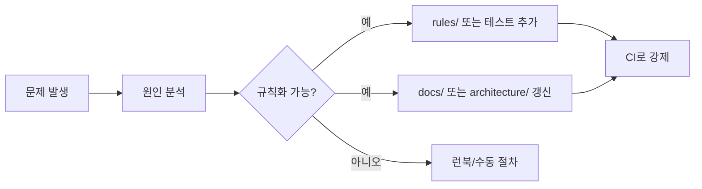

# 자기 개선 시스템

실패를 **일회성 프롬프트 수정**으로 끝내지 않고, 시스템에 흡수한다 (`AGENTS.md` [8]).

## 파이프라인

## 자동 시도와의 경계 (`AUTO_IMPROVEMENT`)

- **자동 개선 루프**(패치 PR 초안·CI 재실행)는 `docs/AUTO_IMPROVEMENT_ON_FAILURE.md`와 `skills/failure-remediation-loop/SKILL.md`가 담당한다.
- **영구 흡수**(규칙·문서·ADR)는 본 문서의 파이프라인이 담당한다. 자동 루프가 통과한 변경이라도, 재발 방지 지식이 없으면 **아직 자기 개선이 끝난 것이 아니다**.

## 에이전트 역할 (스킬 매핑)

| 역할 | 스킬 경로 |
|------|-----------|
| 문서 개선 | `skills/doc-improvement/SKILL.md` |
| 규칙 승격 | `skills/incident-to-rule/SKILL.md` |
| 품질 평가 | `skills/quality-evaluation/SKILL.md` |
| 실패 루프 | `skills/failure-remediation-loop/SKILL.md` |
| 테스트 보강 | `skills/auto-test-generation/SKILL.md` |
| 리팩터 (구조) | 팀 표준 스킬 또는 별도 `skills/refactor-module/SKILL.md` |

## 원인 분석 최소 기록

- **현상**: 무엇이 어긋났는가
- **영향**: 사용자·SLO·보안 중 무엇인가
- **근본 원인**: 5-whys 한 사이클
- **대응**: 즉시 조치 / 영구 조치 구분
- **증적**: 로그 발췌(민감정보 제거), 커밋 해시

## “규칙으로 승격” 기준

- 동일 실수가 2회 이상이거나
- 하드 게이트를 깨뜨렸거나
- 온콜 피로도가 크게 증가한 경우
