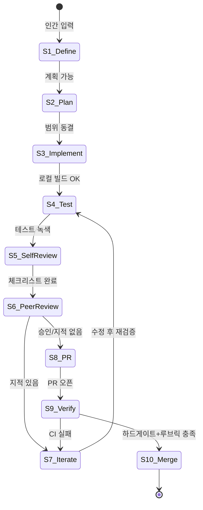

# 에이전트 실행 루프 설계

`AGENTS.md` [4]의 10단계를 **상태 전이·역할·게이트**로 설계한다. 본 문서가 실행 루프의 **단일 진실 공급원(SoT)**이다.

## 1. 단계와 목표 (요약)

| # | 단계 | 목표 산출물 |
|---|------|-------------|
| 1 | 인간이 작업 정의 | `plans/` 초안 또는 추적 가능한 Issue 링크 |
| 2 | 에이전트 실행 계획 | 같은 `plans/`에 단계·리스크·검증·롤백 |
| 3 | 코드 작성 | 레이어·규칙 준수 diff |
| 4 | 테스트 실행 | 로그·통과/실패 요약 |
| 5 | 자기 리뷰 | PR 초안 또는 본문에 체크리스트 |
| 6 | 다른 에이전트 리뷰 | 코멘트·필수 수정 목록 |
| 7 | 수정 반복 | CI 녹색 유지 커밋 |
| 8 | PR 생성 | Why/What/How verified/Risk |
| 9 | 검증 | CI + `evaluations/` 루브릭·체크리스트 |
| 10 | 머지 | main 반영 + (선택) 릴리즈 노트·태그 |

## 2. 상태 전이 (에이전트 관점)

- **되돌림**: `S6`에서 요구사항 불명확 시 `S1`으로 에스컬레이션(인간에게 질문 최소화하되, 제약 모호 시에는 되돌림이 `AGENTS.md` [2]에 부합).

## 3. RACI (책임 매트릭스)

R=실행, A=책임(승인), C=협의, I=통지.

| 단계 | 인간 | 구현 에이전트 | 리뷰 에이전트 | CI |
|------|------|----------------|----------------|-----|
| 1 작업 정의 | **R/A** | C | I | I |
| 2 계획 | I | **R** | C | I |
| 3–4 구현·테스트 | I | **R** | I | C |
| 5 자기 리뷰 | I | **R** | I | I |
| 6 멀티 리뷰 | **A**(정책) | C | **R** | I |
| 7 수정 | I | **R** | C | C |
| 8 PR | I | **R** | C | I |
| 9 검증 | I | C | C | **R** |
| 10 머지 | **A** | R(브랜치 정리) | I | I |

“최소 인간 개입”은 **A가 1·10에 집중**되도록 설계한다 (`AGENTS.md` [4]).

## 4. 단계별 입장·퇴장 기준 (게이트)

- **S1→S2**: 목표 한 문장, 비목표, 하드 제약(보안·호환)이 적혀 있음.
- **S2→S3**: 구현 단계가 90분 단위 이하로 쪼개졌거나, 장시간 작업이면 체크포인트가 명시됨 (`RELIABILITY.md`).
- **S3→S4**: 레이어 역방향 없음(`rules/layering.md`), 비밀 없음(`SECURITY.md`).
- **S4→S5**: 유닛(또는 최소 자동 검증) 녹색.
- **S5→S6**: `skills/self-review/SKILL.md` 항목이 PR에 반영됨.
- **S6→S8**: 리뷰 블로커 해소 또는 기록된 예외(ADR/승인).
- **S8→S9**: PR 본문 필드 완비(`§6`).
- **S9→S10**: `bash scripts/harness-validate.sh` + 팀이 정의한 추가 CI + 하드 게이트(`QUALITY_SCORE.md`).

## 5. 멀티 에이전트 운영 규칙

상세 역할·순서·산출물은 **`docs/MULTI_AGENT_REVIEW.md`**가 SoT다.

- **구현 에이전트(`IMPLEMENTER`)**: 브랜치 푸시, 테스트(자동 생성 포함), PR 본문 초안.
- **리뷰 에이전트(`REVIEWER_QA` / `REVIEWER_SEC`)**: `skills/multi-agent-review/SKILL.md`, `evaluations/checklists/MULTI_AGENT_REVIEW.md` 적용. 보안 차단 시 QA 승인만으로 진행하지 않는다.
- **문서 에이전트**: 가독성·링크·중복 제거(`skills/doc-improvement/SKILL.md`).

## 6. PR 본문 필수 필드

1. **Why** — 왜 바꾸는가 (`plans/` 링크)
2. **What** — 무엇이 바뀌는가
3. **How verified** — 실행한 명령·환경
4. **Risk** — 회귀·롤밄·플래그

## 7. 루프 외부 피드백 (머지 후)

런타임 신호는 `docs/FEEDBACK.md` 층 4로 흡수되고, 반복 이슈는 `docs/SELF_IMPROVEMENT.md` 파이프라인을 탄다.

## 8. 관련 스킬

| 목적 | 스킬 |
|------|------|
| 구현 루틴 | `skills/implement-feature/SKILL.md` |
| PR까지 반복 | `skills/agent-pr-loop/SKILL.md` |
| 자기 리뷰 | `skills/self-review/SKILL.md` |
| 품질 채점 | `skills/quality-evaluation/SKILL.md` |
| 멀티 에이전트 리뷰 | `skills/multi-agent-review/SKILL.md` |
| 자동 테스트 생성 | `skills/auto-test-generation/SKILL.md` |
| 실패 시 자동 개선 루프 | `skills/failure-remediation-loop/SKILL.md` |

## 9. 확장 문서

| 주제 | 문서 |
|------|------|
| 멀티 에이전트 리뷰 구조 | `MULTI_AGENT_REVIEW.md` |
| 자동 테스트 생성 | `AUTO_TEST_GENERATION.md` |
| 로그 기반 피드백 | `LOG_FEEDBACK.md` |
| 실패 시 자동 개선 | `AUTO_IMPROVEMENT_ON_FAILURE.md` |

## 10. 자동 실행(구현)

로컬·CI에서 다음이 **실제로** 실행된다.

- **오케스트레이터**: `bash scripts/harness-agent-loop.sh run --all` (옵션: `--plan`, `--step N`, `HARNESS_PLAN`, `HARNESS_STRICT_PLAN`, `HARNESS_SELF_REVIEW_FILE`)
- **단계별 파일·규칙 매핑**: `docs/AGENT_LOOP_STEP_REFERENCE.md`
- **CI**: `.github/workflows/harness-ci.yml`의 `agent-loop` 잡(PR 시 8단계 PR 본문 검사 포함)
