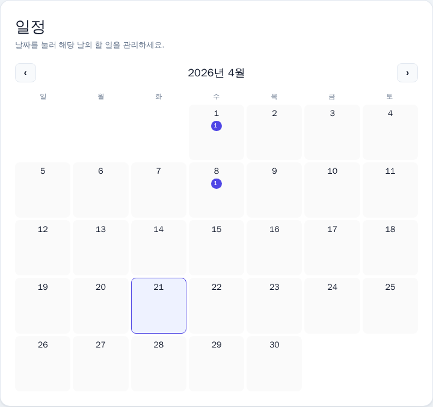
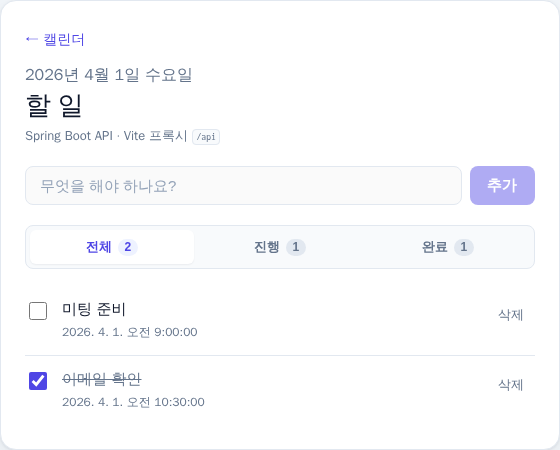
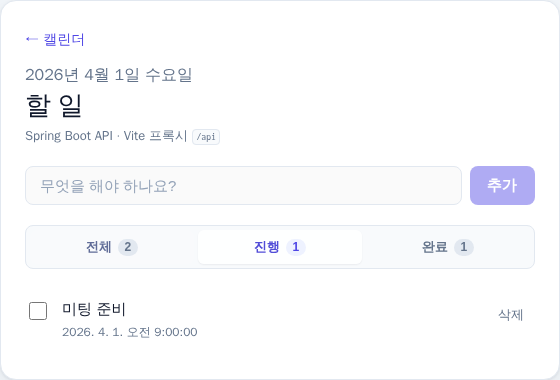

# Todo 샘플 — 하네스 엔지니어링 적용

Spring Boot(Java) REST API + React(Vite) UI로 **날짜별 할 일 관리**를 구현한 예시다. 루트의 하네스 문서(`AGENTS.md`, `docs/WORKFLOW.md`, `architecture/LAYERED_MODEL.md`)와 같은 **레이어 방향**을 따른다.

---

## 기능 정리

| 구분 | 내용 |
|------|------|
| **캘린더(메인)** | 월 단위 그리드. 각 날짜에 **미완료** 할 일 개수 표시. **이전 달 / 다음 달** 이동. 날짜 클릭 시 해당 일의 할 일 화면으로 이동. |
| **일별 할 일** | 선택한 날짜에 할 일만 목록으로 표시. **추가**로 제목을 확정한 뒤 **시·분**을 고르고 **등록**하면 저장되며, 줄 아래에 **일정 시각**이 표시된다. **취소**로 제목 입력으로 돌아갈 수 있다. |
| **필터** | **전체 / 진행 / 완료** 탭과 개수. 목록이 비면 안내 문구 표시. |
| **내비게이션** | 일별 화면 상단 **← 캘린더**로 메인으로 복귀. 잘못된 날짜 URL은 캘린더로 리다이렉트. |
| **데이터** | 각 할 일은 **`scheduledDate`(일자)** 에 묶임. API·DB는 샘플용 **H2 인메모리**(백엔드 재시작 시 데이터 초기화). |
| **품질** | 프론트 Vitest + 커버리지 임계값, Playwright로 UI 캡처 스크립트. |

---

## 제품 사용법 (화면 기준)

아래 화면은 저장소에 포함된 **캡처 이미지**(`frontend/screenshots/readme-*.png`)이며, 레이아웃·순서를 이해하는 용도다. 실제 서비스에서는 **오늘 날짜·본인 데이터**가 표시된다.

### ① 일정(캘린더) — 메인 화면



1. 앱에 들어오면 **「일정」** 제목의 **월 캘린더**가 보인다.  
2. **이전 달 · 다음 달** 버튼으로 월을 바꾼다.  
3. 할 일이 있는 날은 숫자 아래 **보라색 뱃지(미완료 개수)** 로 표시된다.  
4. **날짜 칸 전체**를 누르면 그 날의 할 일 화면으로 이동한다.

### ② 할 일 — 선택한 날짜



1. 상단에 **선택한 날짜**(요일·연월일)와 **「할 일」** 제목이 보인다.  
2. **← 캘린더**를 누르면 다시 ① 화면으로 돌아간다.  
3. **무엇을 해야 하나요?** 에 내용을 적고 **추가**를 누르면, **몇 시에 할지** 시·분을 고른 뒤 **등록**으로 목록에 반영된다. **취소**하면 다시 제목을 고칠 수 있다.  
4. 각 줄의 **체크박스**로 완료/미완료, **삭제**로 항목을 지운다.  
5. 줄 아래 작은 글씨는 **일정 시각**(선택한 시·분)이다.

### ③ 진행 / 완료 탭으로 나누어 보기



1. **전체 / 진행 / 완료** 탭과 **개수**로 목록을 필터한다.  
2. **진행**이면 아직 끝내지 않은 할 일만, **완료**이면 체크한 항목만 본다.

---

## 사용법 (서비스 이용 순서)

### 1. 앱 실행

**Docker(권장)** — 백엔드·프론트가 함께 뜬다.

```bash
cd sample/todo-app
docker compose up --build
```

브라우저에서 **http://localhost:5173** 을 연다.

- API만 직접 호출할 때: **http://localhost:18080** (호스트 포트; `docker-compose.yml`에서 `18080 → 컨테이너 8080`)
- 중지: `Ctrl+C` 또는 `docker compose down`

> 호스트에서 5173·18080이 이미 쓰이 중이면 `docker-compose.yml`의 `ports`를 바꿔도 된다.

**로컬 개발** — 터미널 두 개.

1. 백엔드: `cd sample/todo-app/backend && mvn spring-boot:run` (기본 **8080**)
2. 프론트: `cd sample/todo-app/frontend && npm install && npm run dev` (**5173**, `/api`는 Vite가 **8080**으로 프록시)

역시 브라우저는 **http://localhost:5173** .

### 2. 캘린더에서 날짜 고르기

- 첫 화면(**`/`**)은 **일정** 제목의 월 캘린더다.
- 할 일이 있는 날은 숫자 아래 **뱃지(미완료 개수)** 가 보인다.
- **날짜 칸을 클릭**하면 **`/day/YYYY-MM-DD`** 로 이동한다.  
  예: `http://localhost:5173/day/2026-04-21`

### 3. 그날 할 일 관리하기

- **무엇을 해야 하나요?** 입력 → **추가** → 시·분 선택 → **등록** 순으로 할 일이 생긴다. **취소**로 이전 단계로 돌아간다.
- **체크박스** — 완료/미완료 토글.
- **삭제** — 해당 항목 제거.
- **전체 / 진행 / 완료** 탭으로 목록을 나눠 본다.
- 상단 **← 캘린더**로 다시 월 화면으로 돌아간다.

### 4. URL로 바로 들어가기

- 캘린더: `http://localhost:5173/`
- 특정 날: `http://localhost:5173/day/2026-04-21` (날짜는 `YYYY-MM-DD`)

---

## REST API 요약

| 메서드 | 경로 | 설명 |
|--------|------|------|
| `GET` | `/api/todos?date=YYYY-MM-DD` | 해당 **하루**의 할 일 목록 |
| `GET` | `/api/todos?from=…&to=…` | **기간**(포함) — 캘린더 집계용 |
| `GET` | `/api/todos` | 파라미터 없음 시 **전체** |
| `POST` | `/api/todos` | JSON: `title`, `scheduledDate`(ISO 날짜), `scheduledAt`(ISO-8601 시각, 필수) |
| `PUT` | `/api/todos/{id}` | JSON: `title`, `completed`, `scheduledDate`, `scheduledAt` 중 변경할 필드만 |
| `DELETE` | `/api/todos/{id}` | 삭제 |

응답의 각 할 일에는 `id`, `title`, `completed`, `createdAt`, `scheduledDate`, `scheduledAt`가 포함된다.

---

## 레이어 매핑 (Java)

| 하네스 레이어 | 이 프로젝트 패키지 |
|---------------|-------------------|
| Types | `domain/` (엔티티·도메인 규칙), `dto/` (API 경계 타입) |
| Config | `config/` (CORS 등) |
| Repo | `repository/` (Spring Data JPA) |
| Service | `service/` (유스케이스) |
| Runtime / UI | `web/` (REST 컨트롤러 = 외부 어댑터) |

React는 별도 `frontend/` 앱으로, **UI 표현층**에 해당한다. 백엔드 `web`은 JSON API만 제공한다.

---

## 프론트엔드 개발

```bash
cd sample/todo-app/frontend
npm install
npm run dev          # 개발 서버
npm test             # Vitest + 커버리지
npm run build        # 프로덕션 빌드
```

### UI 캡처 (Playwright)

```bash
cd sample/todo-app/frontend
npm install
npx playwright install chromium   # 최초 1회
npm run capture:ui                  # 루트 화면 요약 PNG
npm run capture:readme              # README용 readme-01~03.png 재생성
```

- **고정 이름:** `frontend/screenshots/latest-heading.png`, `latest-fullpage.png`
- **타임스탬프:** `frontend/screenshots/heading-<ISO>.png`
- **README용:** `frontend/screenshots/readme-01-calendar.png` 등 (`e2e/readme-screenshots.spec.ts`)

로컬 Node가 **18.19 미만**이면 `@playwright/test` 실행이 막힐 수 있다. 그때는 공식 이미지로 한 번에 돌릴 수 있다(저장소의 `frontend`를 마운트).

```bash
cd sample/todo-app
docker run --rm -v "$(pwd)/frontend:/app" -w /app \
  mcr.microsoft.com/playwright:v1.59.1-jammy \
  bash -lc "npm ci && npx playwright test e2e/readme-screenshots.spec.ts"
```

창을 띄워 보려면 `npm run capture:ui:headed`. `capture:ui` 시점의 루트 `h1`은 **「일정」**(캘린더 메인)이다.

---

## 하네스 연동

- 계획: `../../plans/2026-04-20-sample-todo-app.md`
- 구조 스모크: 루트 `evaluations/scripts/check-layer-smoke.sh` (샘플 경로 포함)
- CI: `.github/workflows/sample-todo-ci.yml`
